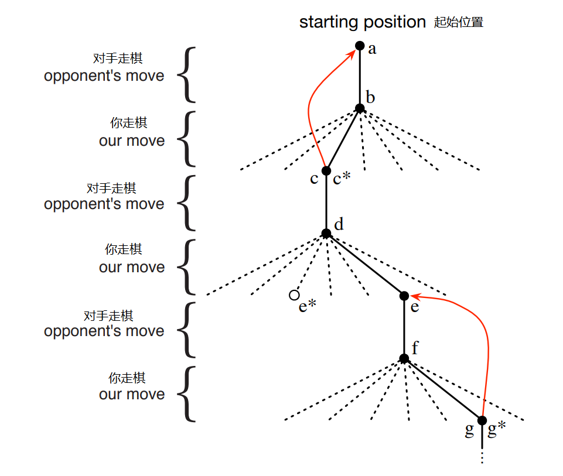

# 第一章 简介

当我们考虑学习的本质时，通过与环境互动来学习的想法可能是我们首先想到的。 当婴儿玩耍，挥动手臂或环顾四周时，它没有明确的老师，但确实与周围环境有直接的感觉运动联系。行使这种联系会产生大量有关因果关系，行动后果以及为实现目标而应采取的行动的信息。在我们的一生中，此类互动无疑是有关我们的环境和我们自己的主要知识来源。 无论我们是学习驾驶汽车还是进行对话，我们都敏锐地意识到环境对我们所做工作的反应，并且我们试图通过行为来影响发生的事情。从互动中学习是几乎所有学习和智力理论的基础思想。

在本书中，我们探索了一种从交互中学习的计算方法。 我们不是直接对人或动物的学习方式进行理论化，而是主要探索理想化的学习环境并评估各种学习方法的有效性。我们采用人工智能研究人员或工程师的观点。我们探索有效解决科学或经济利益学习问题，通过数学分析或计算实验评估设计的机器设计。我们探索的方法称为强化学习，比其他机器学习方法更着重于通过交互进行的目标导向学习。

## 1.1 强化学习

强化学习是在学习如何做（如何将情况映射到行动），以便最大化数字奖励信号。不会告诉学习者要采取哪些行动，而必须通过尝试去发现哪些行动会产生最大的回报。在最有趣和最具挑战性的情况下，行动不仅会影响即时奖励，而且会影响下一个情况，并因此影响所有后续奖励。试错法和延迟奖励这两个特征是强化学习的两个最重要的区别特征。

强化学习是一个问题，是一类解决问题的好方法，还指研究这些问题的整个领域。在这三件事上使用单个名称很方便，但同时必须在概念上保持三者分开。在强化学习中，问题与解决方法之间的区别尤其重要。未能做出这种区分是造成许多困惑的根源。我们使用动态系统理论的思想来形式化描述强化学习的问题，特别是作为不完全已知的马尔可夫决策过程的最优控制。

形式化的细节必须等到第3章，但是其基本思想很简单。学习代理与环境进行即时互动，最终要达成一个目标，我们需要抓住学习体面对的最重要的方面。（原文：The details of this formalization must wait until Chapter 3, but the basic idea is simply to capture the most important aspects of the real problem facing a learning agent interacting over time with its environment to achieve a goal. 自行理解吧，我也只能翻到这了。）学习代理必须能够在某种程度上感知其环境状态，并且必须能够采取影响状态的行动。代理还必须具有与环境状态有关的一个或多个目标。马尔可夫决策过程旨在以最简单的形式包括这三个方面（感觉，行动和目标）。任何非常适合解决此类问题的方法，我们都认为是强化学习方法。

强化学习与监督学习不同，后者是机器学习领域的最新研究。监督学习是从知识渊博的外部监督者提供的一系列带标签的示例中学习。每个示例都是对情况的描述以及系统应针对该情况采取的正确操作的规范（标签），该规范通常用于标识该情况所属的类别。这种学习的目的是使系统推断或概括其响应，以使其在训练集中不存在的情况下也能正确运行。这是一种重要的学习方式，但仅靠它还是不够的。在互动问题中，想要获得既正确，又能够代表所有可能遇到的情况的样本，是不切实际的。在未知的领域（对未知领域的学习对人们更有用），代理必须能够从自己的经验中学到东西。

强化学习也与机器学习研究人员所谓的无监督学习不同，后者通常是寻找隐藏在未标记数据集合中的结构。监督学习和无监督学习这两个术语似乎已对机器学习范例进行了详尽的分类，但事实并非如此。尽管人们可能会倾向于将强化学习视为一种无监督的学习，因为它并不依赖于正确行为的例子，但是强化学习正在尝试最大化奖励信号，而不是试图寻找隐藏的结构。探究代理人经验中的结构肯定对强化学习很有用，但其本身并不能解决最大化奖励信号的强化学习问题。因此，我们将强化学习与监督学习和非监督学习以及其他范式一起，视为第三种机器学习范式。

在强化学习而不是其他类型的学习中出现的挑战之一是**探索与利用的平衡问题(the trade-of between exploration and exploitation)**。为了获得很多奖励，强化学习代理必须更倾向于过去尝试过的，被认为可以有效产生奖励的动作。但是要发现此类操作，它必须尝试以前未选择的操作。代理必须利用已经获得的经验来获得奖励，但也必须进行探索以便将来做出更好的选择。难题在于，在不失败的情况下，不能只进行探索或只进行利用。代理必须尝试各种行动，并逐步支持那些看起来最好的行动。对于随机任务，必须多次尝试每个操作才能获得对其预期回报的可靠估计。数十年来，数学家对探索与利用的困境进行了深入研究，但仍未解决。现在，我们只是简单地注意到，平衡探索与利用的整个问题甚至都没有出现在有监督和无监督的学习中，至少在这些范式的最纯粹形式中并没有出现。强化学习的另一个关键特征是，它明确考虑了目标导向的主体与不确定环境交互的整个问题。这与许多考虑子问题却未解决它们可能如何适应更大情况的方法形成对比。例如，我们提到很多机器学习研究都与监督学习有关，而没有明确说明这种能力最终将如何有用。其他研究人员已经开发了具有总体目标的计划理论，但没有考虑计划在实时决策中的作用，也没有考虑计划必要的预测模型从何而来的问题。尽管这些方法已产生许多有用的结果，但它们对孤立的子问题的关注是一个重大局限。

增强学习采取相反的方法，从完整的，交互式的，寻求目标的代理开始。所有强化学习代理都有明确的目标，可以感知其环境的各个方面，并可以选择影响其环境的行动。而且，通常从一开始就假定代理必须运行，尽管对其所面临的环境存在很大的不确定性。当强化学习涉及计划时，它必须解决计划与实时行动选择之间的相互作用，以及如何获取和改善环境模型的问题。当强化学习涉及监督学习时，它是出于特定原因而决定哪些能力是重要的，哪些不是。为了推动学习进程，必须分离并分开研究重要的子问题，这些子问题应该是完整的、互动性的、寻求目标的代理的一部分，尽管这个代理自己的完整目标还不能定下来。（原文：For learning research to make progress, important subproblems have to be isolated and studied, but they should be subproblems that play clear roles in complete, interactive, goal-seeking agents, even if all the details of the complete agent cannot yet be filled in.）

我们说一个完整的，交互式的，寻求目标的代理，我们并不总是指一个完整的有机体或机器人。这些显然是示例，但是完整的，交互式的，寻求目标的代理程序也可以是更大的行为系统的组成部分。在这种情况下，代理直接与大型系统的其余部分交互，而与大型系统的环境间接交互。举一个一个简单的例子：一个代理，它监视机器人电池的电量并将其发送到机器人的控制体系结构。该代理的环境是机器人的其余部分以及机器人的环境。人们必须超越代理及其环境的最明显示例，才能体会到强化学习框架的普遍性。

现代强化学习最令人兴奋的方面之一是它与其他工程学和科学学科的实质性和富有成果的互动。强化学习是人工智能和机器学习数十年来趋势的一部分，该趋势是与统计，优化和其他数学学科更好地集成。例如，一些强化学习方法使用参数化近似器进行学习的能力解决了运筹学和控制理论中的经典“维数诅咒”。更明显的是，强化学习也与心理学和神经科学产生了强烈的相互作用，双向都有着巨大的好处。在所有形式的机器学习中，强化学习最接近人类和其他动物所做的那种学习，强化学习的许多核心算法最初都是受生物学习系统启发的。强化学习还通过动物学习的心理学模型（与某些经验数据更好地匹配）以及大脑奖励系统各部分的有影响力的模型而有所回报。本书的主体提出了与工程和人工智能有关的强化学习的思想，并在第14章和第15章中概述了与心理学和神经科学的联系。

最后，强化学习也是人工智能向简单通用发展的大趋势的一部分。自1960年代后期以来，许多人工智能研究人员以为没有通用的原理可以发现，而智能只是大量特殊的技巧，程序和启发式方法。有时有人说，如果我们只要将足够的相关事实放入一台机器中，例如一百万或十亿，它就会变得智能。基于一般原理的方法（例如搜索或学习）被称为“弱方法”，而基于特定知识的方法被称为“强方法”。这种观点在今天仍然很普遍，但并不占主导地位。从我们的角度来看，这还为时过早：在寻求一般原则时得出的结论太少，以至于没有结论。现代人工智能现在包括许多研究，以寻找学习，搜索和决策的一般原理。目前尚不清楚摆将向后摆动多远，但强化学习研究无疑是向更简单和更少的人工智能通用原理回摆的一部分。

## 1.2 例子
理解强化学习的一种好方法是考虑一些指导其发展的示例和可能的应用。

+ 国际象棋大师的走棋。通过计划（预期可能的反应和对这些反应的回击）以及对特定位置和动作的合意性的立即，直观的判断，做出选择。

+ 自适应控制器实时调整炼油厂的运行参数。控制器根据指定的边际成本，优化收益/成本/质量之间的折衷策略，而不必严格遵守工程师最初建议的设定参数。

+ 羚羊出生后几分钟就挣扎着站起来。半小时后，它可以以每小时20英里的速度运行。

+ 移动机器人决定是否应该进入一个新房间以寻找更多的垃圾来收集，还是开始尝试返回电池充电站。它根据电池的当前电量以及过去能够快速便捷地找到充电器的经验来做出决定。

+ 菲尔准备早餐。即使是这种表面上平凡的活动，也显示出复杂的条件行为网络和目标-次目标之间的相互联系：走到橱柜，打开它，选择一个谷物盒，然后伸手去拿，抓紧并取回盒子。经过其他复杂的，经过调整的交互行为序列，才能获得碗，勺子和牛奶纸箱。每个步骤都涉及一系列的眼球运动，以获取信息并指导伸手和运动。对于如何携带物品或在获取其他物品之前先将其中的一些物品运送到餐桌上，会不断做出快速的判断。每个步骤均以目标为指导，例如握住勺子或上冰箱，并达到其他目标，例如一旦准备好谷物就可以将勺子与食物一起食用，并最终获得营养。不管他是否意识到，菲尔都在访问有关其身体状况的信息，该信息决定了他的营养需求，饥饿程度和食物偏好。

这些例子展示的特征都很基本，所以很容易被忽视。他们都牵扯到一个做决策的代理和环境之间的*互动*，在环境中，代理期望达成自己的*目标*，但是环境中有*不确定性*。代理的行为可以影响环境的未来状态（比如，下一个棋子的位置，炼油厂的库存，机器人的下一个位置，电池的充电情况等。），从而影响代理接下来的行为和机会。正确的选择需要考虑行为间接的，延迟的后果，所以需要前瞻和计划。

同时，在所有这些示例中，动作的效果无法完全预测。因此，代理必须经常监视其环境并做出适当的反应。例如，菲尔必须注意倒入谷物碗的牛奶，以防止牛奶溢出。所有这些示例都涉及明确的目标，即代理可以根据其直接感知的结果来判断实现目标的进度。下象棋的人知道他是否获胜，炼油厂的控制者知道产生了多少石油，小羚羊知道它摔倒了，移动机器人知道它的电池何时耗尽，而菲尔知道他是否在享用早餐。

在所有这些示例中，代理可以利用其经验来随着时间的推移改善其性能。下象棋的人改善了他用来评估位置的直觉，从而改善了他的下法；小羚羊提高了它的跑步效率；菲尔学会精简做早餐的流程。代理带到这个任务的知识，可以是之前经历中学到的，也可以是进化得来的，都会影响什么是有用的或者什么容易学，但是和环境的交互对于为完成任务而调整自己的行为是至关重要的。

## 1.3 强化学习的元素

除了主体和环境之外，强化学习系统还有四个主要元素：策略，奖励信号，价值函数以及可选的环境模型。

**策略(policy)**规定了学习代理在给定时间的行为。粗略地说，策略是从感知到的环境状态到在这些状态下要采取的行动的映射。它对应于心理学上被称为一套刺激-反应规则或联想的东西。在某些情况下，该策略可能是简单的函数或查找表，而在其他情况下，它可能涉及大量的计算，例如搜索过程。该政策是强化学习代理的核心，就其本身而言，它足以确定行为。通常，策略可能是随机的，但是给定了每个行为的概率。

**奖励信号(reward signal)**定义了强化学习问题的目标。在每个时间点上，环境都会向强化学习代理发送一个代表奖励的数字。代理的唯一目标是在长期内获得最大的总回报。奖励信号因此定义了对代理而言什么是好事，什么是坏事。在生物系统中，我们可能认为奖励类似于愉悦或痛苦的经历。它们是代理面临的问题的直接和定义特征。奖励信号是更改策略的主要依据；如果该策略选择的操作之后是低奖励，则将来可能会更改该策略以选择该情况下的其他一些操作。一般而言，奖励信号可能是环境状态和所采取行动的随机函数。

奖励信号在近期意义上指示什么是好的，而**价值函数(value function)**则从长远来看指示什么是好的。粗略地说，状态的价值是代理从该状态开始可以期望在未来积累的总奖励金额。奖励决定了环境状态的即时，内在的可取性。而值表示考虑了可能遵循的状态以及这些状态中可获得的奖励后，对状态的**长期**期望。例如，一个状态可能总是产生低的立即回报，但仍然具有很高的价值，因为跟随着它总是有其他产生高回报的状态。情况也可能正好相反。打个比方，奖励有点像愉悦感（如果很高）和痛苦（如果很低），而价值则对应于我们对我们的环境处于特定状态的满意程度或满意度的更精致和有远见的判断。

感觉是主要的，而价值（作为对奖励的预测）则是次要的。没有奖励就不可能有价值，而估计价值的唯一目的就是获得更多的奖励。但是，在制定和评估决策时，我们最关心的是价值。根据价值判断做出行动选择。寻求最高价值而不是最高回报的状态，因为从长远来看，这些行动会为我们带来最大的回报。不幸的是，确定价值比确定奖励要困难得多。奖励基本上是由环境直接给予的，但是价值必须根据代理在其整个生命周期中进行的观察序列来不断地估计和重新估计。实际上，我们考虑的几乎所有强化学习算法中最重要的组成部分是一种科学估算价值的方法。价值评估的中心作用可以说是过去六十年来有关强化学习的最重要的知识。

一些强化学习系统包括第四个要素，**环境模型(a model of the environment)**。这是模仿环境行为的东西，或更笼统地说，是可以推断出环境的行为方式。例如，给定状态和动作，模型可以预测所得的下一个状态和下一个奖励。模型用于**计划(planning)**，我们指的是通过实际考虑可能出现的未来情况来决定行动方案的任何方式。使用模型和计划来解决强化学习问题的方法被称为**基于模型的(model-based)**方法，与简单的**无模型(model-free)**方法（明确地说，是试错学习(trial-and-error)）相反，它们被认为与计划相反。在第8章中，我们探索了强化学习系统，该系统可以通过试错法同时学习，学习环境模型并将该模型用于计划。现代强化学习涵盖了从低层的试错学习到高层的深思熟虑的计划的范围。

## 1.4 增强学习的局限和本书的讨论范围

强化学习在很大程度上依赖于状态的概念，即作为策略和价值函数的输入，以及作为模型输入和输出的状态。非正式地，我们可以将状态视为传递给代理的某种信号，以了解环境在特定时间的状况。状态的形式化定义是由第3章中提出的马尔可夫决策过程框架给出的。但是，更广泛地讲，我们鼓励读者遵循非正式的含义，并认为状态是代理可以获取的关于环境的任何信息。实际上，我们假设状态信号是由某种预处理系统产生的，该系统名义上是代理所在环境的一部分。在本书中，我们不讨论构造，更改或学习状态信号的问题（第17.3节中只是简要介绍）。我们采取这种方法不是因为我们认为状态表示不重要，而是为了充分关注决策问题。换句话说，本书中我们关注的不是设计状态信号，而是根据可用的状态信号来决定采取何种行动。

本书中考虑的大多数强化学习方法都是围绕估计值函数构造的，但是解决增强学习问题并非绝对必要这样做。例如，诸如遗传算法，遗传编程，模拟退火和其他优化方法之类的求解方法永远不会估计值函数。这些方法应用多个静态策略，每个策略在较长的时间段内与单独的环境实例进行交互。获得最大奖励的策略及其随机变化将被延续到下一代策略，然后重复该过程。我们之所以称其为进化方法，是因为它们的操作类似于生物进化产生具有熟练行为的生物的方式，即使它们在一生中没有学习。如果策略的空间足够小，或者可以进行构造使得好的策略很容易找到，或者有足够的时间进行搜索，那么进化方法就可以有效地发挥作用。此外，进化方法在学习主体无法感知其环境完整状态的问题上具有优势。

我们的重点是在与环境交互时学习的强化学习方法，而进化方法则无法做到。在许多情况下，能够利用个体行为交互的细节的方法可能比进化方法更为有效。进化方法忽略了强化学习问题的许多有用结构：它们没有使用他们正在寻找的政策是从状态到行动的函数这一事实；他们不会注意到一个个体在其一生中会经历哪个状态，或者选择了哪个动作。在某些情况下，此信息可能会引起误解（例如，接收到的状态是错误的），但更多情况下，它应该可以使搜索更有效。尽管进化和学习具有许多功能并且可以自然地协同工作，但我们并不认为进化方法本身特别适合强化学习问题，因此，我们在本书中没有介绍它们。

## 1.5 一个扩展的例子：井字棋

为了说明强化学习的一般思想并将其与其他方法进行对比，我们接下来将更详细地考虑一个示例。

考虑一下熟悉的儿童井字游戏。两个玩家轮流玩三乘三局。一名玩家玩X，另一名玩O，直到一名玩家通过在水平，垂直或对角线上连续放置三个标记获胜为止。如果没有一个连续三名球员，那么游戏就是平局。因为熟练的玩家可以玩而不会输，所以我们假设我们正在与一个不完美的球员比赛，这个玩家有时会犯错误并且允许我们赢。现在让我们考虑平局和输掉一样，对我们同样不利。怎样构建一个玩家的模型，它能够找到对手的失误并且最大化自己获胜的概率？

尽管这是一个简单的问题，但不能以令人满意的方式，通过经典技术轻松解决。例如，博弈论（Game Theory）中经典的“极小极大”解法在这里是不正确的，因为它需要假定对手的一种特殊的玩法。

（译者注：极大极小策略是博弈论的一种解法。博弈论中研究的一般是奖励，但是这里是极小极大，因为这里计算的是失败的可能。因为你作出决策后对手也可以作出决策，在给定你的策略的情况下，你可以估计对手选择对你最不利的决策，也就是最小收益。从所有决策的最小收益中选择最大的，可以保证无论对手选什么，收益都不会比该最大化的最小收益差。把收益换成损失同理，只是反过来。）

例如，一个采用极小极大策略的玩家永远都不会进入可能失败的游戏状态，即使只要对手失误了它就可以赢。（因为上文规定了，平局和输是一样的，但是玩过的都知道，任意一方总是可以做到让你平局。）针对顺序决策问题的经典优化方法（例如动态规划）可以为任何对手计算出最佳解决方案，但需要输入该对手的完整规范描述(specification)，包括对手在每个棋盘状态下进行移动的概率。让我们假定此信息对于该问题不是先验的，因为对于大多数具有实际意义的问题而言确实是这样的。另一方面，可以根据经验估计这种信息，在这种情况下，可以通过与对手进行很多次游戏来进行。关于此问题的最佳解决方案是，首先学习一个达到一定置信度的对手行为模型，然后在给定近似的对手模型的情况下，应用动态编程来计算最优解。其实，这与本书后面讨论的增强学习算法并无二样了。

一种适用于此问题的进化方法将直接在可能的策略空间中搜索具有较高获胜机会的策略。在这里，策略是一项规则，告诉玩家在游戏中的每种状态下，X和O的位置如何。对于所考虑的每个策略，将通过与对手玩多次游戏来获得其获胜概率的估计。然后，该评估将指导下一步考虑哪些政策或政策。一种典型的进化方法是在策略空间使用爬山算法(hill-climb in policy space，一种启发式算法)，先后生成和评估政策，以期获得增量改进。或者，也许可以使用遗传方式的算法来维护和评估一系列策略。真的是有上百种能用的方法，不是夸张的说。

现在我们用值函数的方法解决这个问题。首先，我们将建立一个数字表，每个可能的游戏状态对应一个数字。每个数字都是对我们从该状态获胜的可能性的最新估计。我们将此估计值视为状态值，整个表是学习到的值函数。如果当前对我们从$A$获胜的可能性的估计高于从$B$得出，则状态$A$的价值高于状态$B$，或者被认为比状态$B$更好。假设我们总是用X下棋，那么对于所有有3个X在一行、一列、一斜的状态，获胜的机率是1，因为我们已经赢了。同样，对于所有3个O在一行，一列、一斜的状态，获胜的概率为0，因为我们无法从中获胜。我们将所有其他状态的初始值设置为0.5，这表示我们有50％的获胜机会。

然后我们与对手进行了许多比赛。为了选择我们的动作，我们检查了每个可能动作（棋盘上的每个空白空间）所产生的状态，并在表中查找了它们的当前值。在大多数情况下，我们会贪婪地移动，选择导致价值最大化（即获胜概率最高）的状态的移动。但是，有时我们会从其他动作中随机选择。这些之所以被称为探索性动作(exploratory moves)，是因为它们使我们体验到了原本可能从未见过的状态。在游戏中进行和考虑的一系列动作可以如图1.1所示。在玩游戏时，我们会更改游戏过程中所处状态的值。我们试图使他们更准确地估计获胜的概率。为此，我们将每次贪婪移动之后的状态值备份到移动之前的状态，如图1.1中的箭头所示。更准确地说，更新较早状态的当前值使其更接近较晚状态的值。这可以通过将较早状态的值向较晚状态的值移动一小部分来完成。如果让$S_t$表示贪婪移动之前的状态，而$S_{t+1}$表示贪婪移动之前的状态，则对$S_t$的估计值的更新（记为$V(S_t)$）可以写为
$$
V(S_t) \leftarrow V(S_t) + \alpha \left[ V(S_{t+1}) - V(S_t) \right]
$$

其中$\alpha$是一个较小的数，叫做**步长参数(step-size parameter)**，它会影响学习率。这种更新规则是**时序差分(temporal-difference)**算法的一个例子，之所以这么叫是因为值函数的改变是基于两个连续时刻值函数的差值$V(S_{t+1})-V(S_t)$。

**图1.1：**井字棋的走棋序列。黑色实线表示游戏过程中的移动。虚线表示我们（我们的强化学习玩家）考虑但未做出的动作。我们的第二个举动是探索性的举动，这意味着即使另一个兄弟举动（导致e的举动）排名较高，它还是被采纳了。探索性动作不会产生任何学习效果，但是我们的每一个其他动作都会带来学习效果，从而导致更新，该更新由红色箭头表示，其中估计值从树中的较新节点向上移动至较早节点，如文本中所述。

上述方法在此任务上执行得很好。例如，如果步长参数随着时间适当减小，则对于任何固定的对手，此方法都可以收敛到在给定玩家最佳玩法的情况下从每种状态获胜的真实概率。此外，随后采取的动作（探索性动作除外）实际上是针对此（不完美）对手的最佳动作。换句话说，该方法收敛于用于与该对手玩游戏的最佳策略。如果步长参数没有随着时间的流逝而一直减小到零，那么该玩家还可以很好地抵抗那些慢慢改变其玩法的对手。

这个例子说明了进化方法和学习价值函数的方法之间的差异。为了评估策略，进化方法将策略固定下来并针对对手进行很多游戏，或者使用对手模型来模拟很多游戏。获胜的频率给出了该策略获胜的概率的无偏估计，可用于指导下一个策略的选择。但是，只有在许多游戏之后才进行策略更改，并且仅使用每个游戏的最终结果：游戏过程中发生的事情将被忽略。例如，如果玩家获胜，则将其在游戏中的所有行为都给予奖励，而与特定动作对获胜的重要性无关。甚至可以奖励从未发生过的动作！相反，值函数方法允许评估各个状态。最后，进化和价值函数方法都在搜索策略空间，但是学习价值函数则利用了游戏过程中可用的信息。

这个简单的例子说明了强化学习方法的一些关键特征。首先，强调在与环境互动时学习，在这种情况下是与对手玩家互动。其次，有一个明确的目标，正确的行为需要计划或预见，要考虑到选择的延迟效应。例如，简单的强化学习玩家将学到位一个没有远见的对手设置一些长期的陷阱。强化学习解决方案的一个显着特征是，它可以在不使用对手模型且无需对未来状态和动作的可能序列进行显式搜索的情况下实现计划和前瞻的效果。

尽管此示例说明了强化的一些关键特征学习，但是它是如此简单，以至于给人的印象是，强化学习比实际学习更受限制。尽管井字游戏是一个两人游戏，但强化学习也适用于没有外部对手的情况，即“与自然的游戏”。强化学习也不限于行为分解为单独的情况的问题，例如单独的井字游戏，并且仅在每个情况的结尾进行奖励。当行为无限期地持续并且可以在任何时候收到各种数额的报酬时，它也是适用的。强化学习还适用于不能分解为离散时间步长的问题，例如井字游戏。一般性原则也适用于连续时间问题，尽管理论变得更加复杂，我们在这里做简介的时候把它略去了。

井字游戏具有相对较小的有限状态集，而当状态集非常大，甚至无限大时也可以用。例如，Gerry Tesauro（1992，1995）将上述算法与人工神经网络结合起来，学习了具有约$10^{20}$个状态的西洋双陆棋。拥有如此众多的状态，不可能经历其中的一小部分。Tesauros的程序比任何以前的程序都要好得多，并且最终要比世界上最好的人类选手更好（第16.1节）。人工神经网络为程序提供了根据其经验进行概括的能力，因此在新状态下，它会根据由其网络确定的，从过去面临的类似状态中保存的信息来选择动作。强化学习系统在具有如此大状态集的问题中的运行情况与如何从过去的经验中得出的结论密切相关。正是在这种情况下，我们最需要监督学习和增强学习方法。人工神经网络和深度学习（第9.6节）不是唯一的方法，也不一定是最好的方法。

在井字棋的例子中，学习之前，程序除了游戏规则没有任何的知识，但是增强学习绝不意味着学习和掌握智力。相反，已知信息可以通过多种方式纳入强化学习中，这对于有效学习至关重要（例如，请参见第9.5、17.4和13.1节）。我们在井字棋的例子中能够看到真实状态，而强化学习也可以在只有部分状态被发现，或者状态不同但是观测到现象是相同的情况下，也是适用的。

最后，井字棋玩家能够向前看，并知道其可能的动作所产生的状态。为此，它必须拥有一个游戏模型，以使其能够预见其环境将如何响应可能从未做出的动作而改变。许多问题是这样的，但在其他问题中，甚至缺乏行动效果的短期模型。无论哪种情况都可以应用强化学习，不需要模型，但是只要模型可用或可以学习就可以轻松使用（第8章）。

另一方面，也有不需要任何环境的强化学习方法。无模型系统甚至无法考虑其环境将如何响应单个操作而发生变化。在这种意义上，井字棋玩家相对于其对手是无模型的：它没有任何形式的对手模型。因为必须合理地精确地模型才能有用，所以当解决问题的真正瓶颈在于构造足够精确的环境模型时，无模型方法可能比更复杂的方法更具优势。无模型方法也是基于模型的方法的重要组成部分。在本书中，我们先讨论无模型方法，然后再讨论如何将其用作更复杂的基于模型的方法的组成部分。

增强学习可以用于系统的高层也可以用于低层。尽管井字游戏玩家仅了解游戏的基本操作，但是没有什么可以阻止增强学习在更高层次上进行的，在更高层次上，每个动作本身就是一个复杂的方法。在分层学习系统中，强化学习可以同时在多个级别上进行。

## 习题1

习题1.1： 自我博弈(Self-Play)

假设不是和随机的对手玩，而是用上述的算法来对弈，两边同时学习，会发生什么？学得的策略会有不同吗？

习题1.2： 对称(Symmetries)

井字棋的棋盘是对称的，所以很多棋局其实是一样的。怎样修改学习的过程来利用这一点？这会怎样改善学习的过程？再假设你的对手没有利用对称，那么我们应该利用对称吗？如果利用，对称等价的位置必须有相同的值函数吗？

习题1.3： 贪心玩法(Greedy Play)

假设增强学习的玩家是**贪心的(greddy)**，也就是，总是选择当前评估下的最佳位置。他的表现和非贪心玩家相比，是更好还是更糟糕？会出现什么问题？

习题1.4： 从探索中学习(Learning from Exploration)

假设学习参数每次移动都更新，包括探索性的移动。如果步长参数逐渐减小（但是探索的倾向不减小），那值函数会收敛到一组别的值。从概念上讲，这两组概率值的意义是什么？加入我们继续探索，哪一组值更容易学习？哪一组更可能获胜？

习题1.5： 其他提升(Other Improvements)

你能想到其他方法提升增强学习的玩家吗？你能想到其他更好的方法来解决井字棋问题吗？

## 1.6 小结

