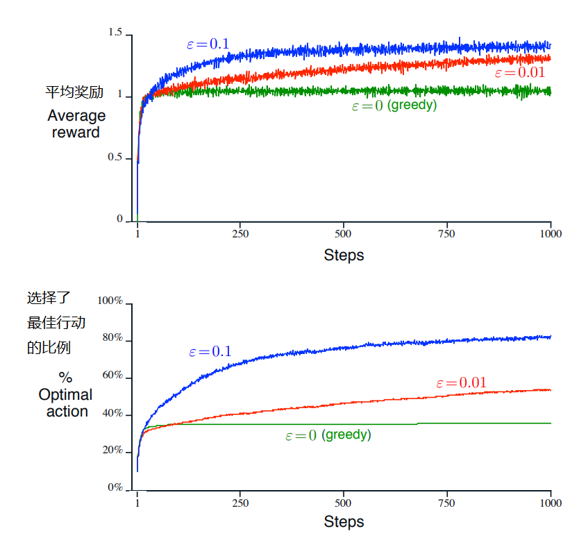
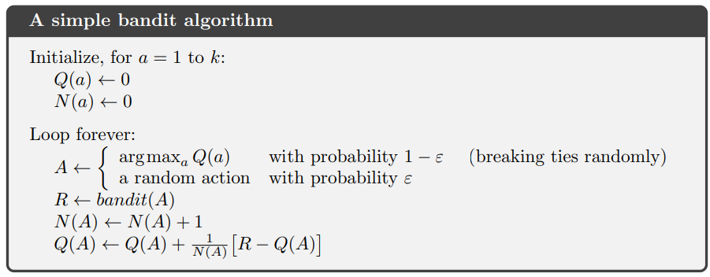

# 第二章 多摇臂赌博机问题

将强化学习与其他类型的学习区分开来的最重要特征是，它使用训练信息来评估所采取的行动，而不是通过给出正确的行动来进行指导。这就是需要主动探索，明确搜索良好行为的原因。纯粹的评估反馈表明所采取的措施有多好，但并不能说明它是可能的最佳或最差的措施。另一方面，纯粹具有指导意义的反馈指出了要采取的正确行动，而与实际采取的行动无关。这种反馈是监督学习的基础，包括模式分类的大部分，人工神经网络和系统识别。以它们的纯粹形式，这两种反馈是截然不同的：评估反馈完全取决于所采取的行动，而指导性反馈则与所采取的行动无关。

在本章中，我们将在一种简化的情况下研究强化学习的评估方面，简单到最多只应对一种情况。这种**非关联(nonassociative)**的设置是其中大多数涉及评估反馈的先前工作都已完成的设置，它避免了全面强化学习问题的大部分复杂性。通过研究这种情况，我们可以最清楚地看到评估性反馈与指导性反馈之间的差异，并且可以相结合。

我们探讨的特定的非关联性，评估性反馈问题是**k-摇臂赌博机问题(k-armed bandit problem)**的简单版本。我们使用这个问题来介绍许多基本的学习方法，这些方法将在后面的章节中扩展以应用于完整的强化学习问题。在本章的最后，我们通过讨论当摇臂赌博机问题变为**关联性(associative)**的，即需要在不止一种情况下行动，向完全强化学习问题迈进了一步。

## 2.1 k-摇臂赌博机问题

你面临这样的学习问题：你有k个选择，选1次可以按照某个分布随机获得奖励（当然跟你的选择有关）。现在要你选很多次，比如1000次，或者叫1000个**时间步长(time steps)**。现在已知分布不变，你如何在长期获得最大收益？

这就是原始的k-摇臂赌博机问题。之所以这么叫，是因为很像玩老虎机，只不过是有k个摇臂，行为就是从这k个摇臂中选一个摇下去，收益就是赢的钱。还有一种比喻，是说医生给一群病人治病（一个病人是一个时间步长），选择的治疗方法是行动，病人的治疗效果是收益。现在我们把这种简单的问题统称摇臂赌博机问题。

在k-摇臂赌博机问题中，k个行动都有自己的期望收益，这就是这个行动的值(value)。我们记时间步$t$上选择的行动为$A_t$，对应的奖励是$R_t$，任意行动$a$的值记作$q_*(a)$，其实就是在给定行动a时的期望收益
$$
q_*(a) \ \dot{=} \ \mathbb{E} [R_t|A_t=a]
$$

如果你知道每个行动的值，那这问题就太好办了，你一直选值最高的就行了。这就是贪心(greedy)行动。这样选就叫利用(exploiting)当前关于值的知识。如果你选的是不贪心的行动，那就是探索(exploring)行动，因为这样你对值的分布的知识就增加了，可以提升你的估计。利用(exploitation)可以用来最大化当前步的收益，但是探索(exploration)更有利于长远看获得更大的利益。例如，假设贪婪行动的价值是确定的，而其他几项行动的评估结果几乎相同，但存在很大的不确定性。这种不确定性使得这些其他动作中的至少一个实际上可能比贪婪的动作要好，但是您不知道哪个。如果您还有很多时间，那么探索非贪婪的行动并发现其中哪个比贪婪的行动更好。在短期内，探索过程中的奖励较低，但从长期来看，奖励较高，因为发现更好的操作后，您可以多次使用它们。由于不可能通过任何一个单一的动作选择来进行探索和利用，因此人们经常提到探索与利用之间的“冲突”。

在任何特定情况下，探索还是利用，都将以复杂的方式取决于估计的精确值，不确定性以及剩余步骤的数量。 对于K摇臂赌博机问题的特殊数学公式和相关问题，有许多复杂的方法可以平衡探索和利用。 但是，大多数这些方法都对平稳性和先验知识做出了强有力的假设，这些强假设在实际应用以及我们将在后续章节中考虑的全面强化学习问题中会被违反或无法验证，这些方法也就毫无用武之地。

在本书中，我们无需考虑如何以复杂的方式平衡探索和利用。我们只要有平衡就行了。在本章中，我们介绍了几种用于解决K臂赌博机问题的简单平衡方法，并表明它们比总是利用的方法好得多。平衡探索与开发的需要是强化学习中出现的一个独特挑战。 我们的k-摇臂赌博机问题的简单性使我们能够以特别清晰的形式展示这一点。

## 2.2 行动-值 方法

首先看一下估计动作的值和利用这种估计来决策的方法。一个动作的值应该是这个动作的奖励的期望，所以我们很自然地就就想到，可以用我们已经收到的奖励的均值来表示。

$$

Q_t(a) \dot{=} \dfrac{ t时刻前动作a收到的全部奖励 }{ t时刻前a动作的次数 } = \dfrac{ \sum_{i=1}^{t-1}R_i · \mathbf{1}_{A_i=a} }{\sum_{i=1}^{t-1}\mathbf{1}_{A_i=a} }

$$

其中$\mathbf{1}_{predicate}$代表一个随机变量，predicate（谓词）代表的条件满足则为1，否则为0。如果这个动作没有做过，那太可惜了，我们给他一个默认值。根据大数定律，当动作次数趋向于无穷时，$Q_t(a)$收敛于$q_*(a)$.我们就叫他**简单平均(sample-average)**方法好了。

然后看看怎么挑选行动。最简单的挑法就是选值最高的了，就是贪心法嘛！如果有很多个值最高的，那就随便选一个。把这种贪心法写下来就是：

$$
A_t \dot{=} \underset{a}{argmax} Q_t(a)
$$

贪心法就是总是选当前直接的最大收益，但是咱们也得多探索一下，不能一棵树上吊死。一种简单的办法就是：每次有$\epsilon$的概率随机选一个。这就是$\epsilon$-贪心法($\epsilon$-greedy method)。

这样就可以保证会不会一棵树上吊死了，函数也可以收敛了，不过这也说明了，等到收敛了之后，也只有$1-\epsilon$的概率是按照q函数选的，所以平均正确率不会超过$1-\epsilon$。而且，这些都是渐进分析，假设你真的能收敛，实际上效果怎么样都不知道。

**练习2.1** 在$\epsilon$-贪心法中，如果只有两个行为，取$\epsilon=0.5$，那选中的是那个贪心的选择的概率是多少（也就是按照值函数找出来的选择）？

## 2.3 用10个摇臂测试一下

为了测试$\epsilon$-贪心法的效果，我们用10个摇臂来测试一下，跑了2000次实验。每一次实验，我们用标准正态分布生成了10个动作的真值，然后给奖励的时候是按照均值为真值，方差为1的正态分布随机给出的，我们起个名字，叫他10摇臂试验台(10-armed testbed)。以后所有的学习方法，都用这个试验台来跑，一次跑1000步以上，跑个2000次，我们就可以得到一个平均的性能了。

**图2.2** $\epsilon$-贪心法在10摇臂试验台上的平均表现。

看图，你会发现：
1. 所有的方法都收敛了
2. 纯贪心法刚开始平均收益上升快，后来掉了
3. 纯贪心法最后的效果没有$\epsilon$-贪心效果好，因为容易卡在一些次优点(suboptimal)
4. 纯贪心法仅仅在不到1/3的时候选择了最优行动
5. 其他自己看，不是很重要

$\epsilon$-贪心的效果好也是看学习任务的种类的，噪音多的任务$\epsilon$-贪心的效果好，反之噪音少，$\epsilon$-贪心会浪费一些获取最大收益的机会，效果又不好了。如果任务还是动态的，奖励会变化，那$\epsilon$-贪心还是有必要的，要不然就卡住不动了。实际上大多数问题都是变化的，所以我们还是要在探索和利用之间权衡。

**练习2.2** 摇臂的例子 假设k=4，有1，2，3，4这4种行为，用$\epsilon$-贪心和简单平均法来估计，把初始值都设为0。$Q_1(a) = 0, \forall a$.现在实验开始，得到了一系列的动作和奖励：$A_1 = 1,
R_1 = 1, A_2 = 2, R_2 = 1, A_3 = 2, R_3 = 2, A_4 = 2, R_4 = 2, A_5 = 3, R_5 = 0$。请你确定哪些时间步上的选择绝对是随机选择的，哪些可能是随机选择的。

**练习2.3** 在图2.2中，哪种方法在长期累计奖励和可能性下表现更好，好多少（算出数来）。

(练习2.1参考答案：0.75)

## 2.4 使用增量

咱们之前都是算平均值，但是我突然想起来数学老师教我，可以用增量公式来更新平均值，不用每次都算一遍，可把我高兴坏了。

咱们的Q值$Q_n = \dfrac{R_1+R_2+···+R_{n-1}}{n-1}$就是原来的平均值，增量公式：
$$
Q_{n+1} = Q_n + \dfrac{1}{n}[R_n - Q_n]
$$

所以以后更新值都写成这样：
$$
新的值估计 \leftarrow 原来的值估计 + 步长 * [ 目标 - 原来的值估计 ]
$$
目标就是实际的值，你不是为了估计这个实际的值吗，所以这个差$[ 目标 - 原来的值估计 ]$就是误差(error)，通过向"目标"走了一步，减小这个误差，走的这一步有一个步长，这里咱们取得步长是$\frac{1}{n}$，其实不一定非要取这个数，咱们把这个数都记成$\alpha$，或者叫$\alpha_t(a)$。

现在万事俱备，可以把算法写成伪代码了。

## 2.5 非静态问题

